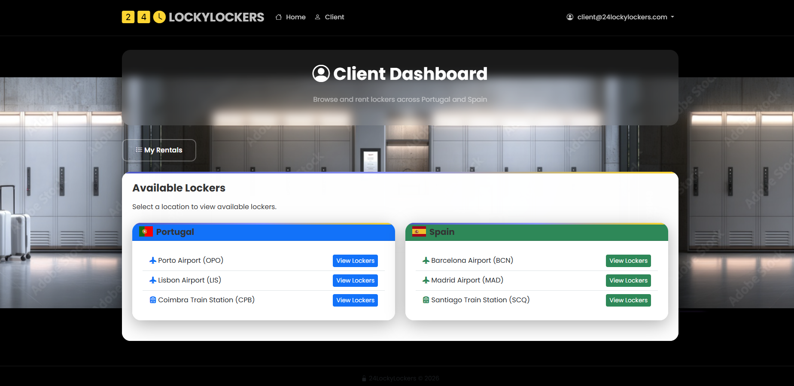
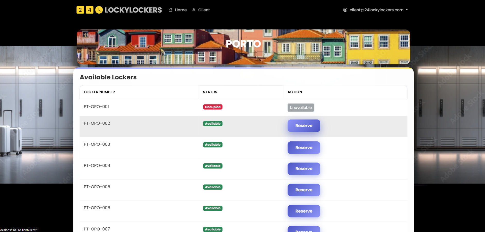
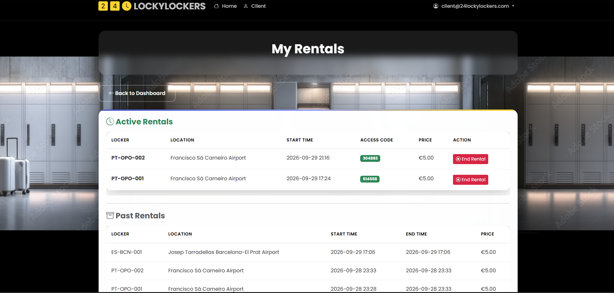
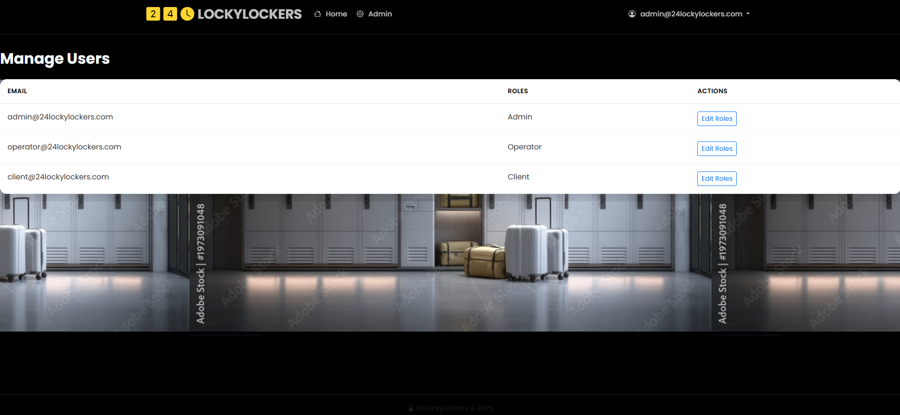
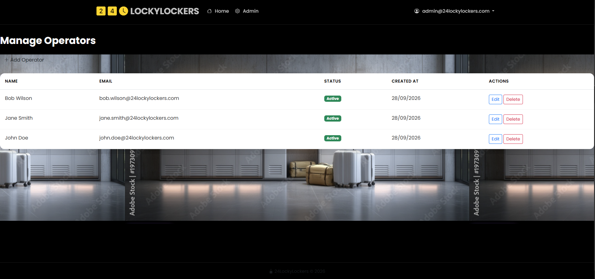
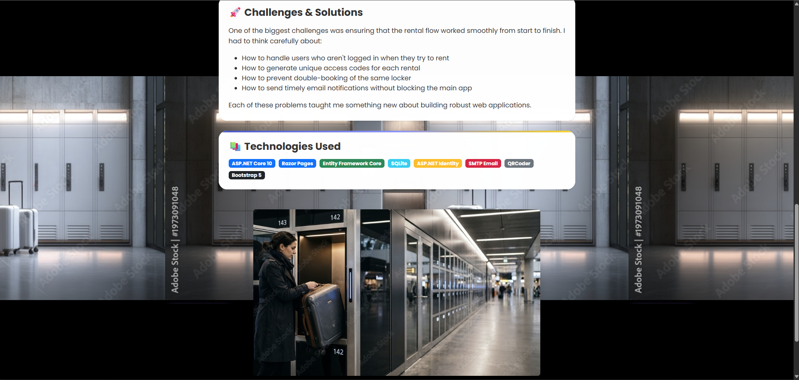

# 🔐 24LockyLockers

Smart locker management system developed as a portfolio project to demonstrate full-stack web development skills with ASP.NET Core.

> **Note:** This project was developed as part of my personal portfolio to showcase my .NET development capabilities.


---

## 📖 About the Project

**24LockyLockers** is a smart locker management system that enables:

- **Clients:** Rent lockers, get access codes, manage rentals
- **Operators:** Manage locations, lockers, and daily operations
- **Administrators:** Full user, operator, and system management

### 🎯 Key Features

- ✅ Role-based authentication and authorization (Admin, Operator, Client)
- ✅ Location and locker management
- ✅ Rental system with unique access codes
- ✅ Email notifications for confirmations and reminders
- ✅ Background service for automatic expired rental management
- ✅ Admin dashboard with real-time statistics
- ✅ Responsive and modern UI with Bootstrap 5

---

## 🏗️ Project Architecture

```
24LockyLockers/
├── Data/                    # ApplicationDbContext and configurations
├── Models/                  # Domain entities (User, Locker, Rental, etc.)
├── Pages/                   # Razor Pages (UI)
│   ├── Admin/              # Admin pages
│   ├── Operator/           # Operator pages
│   └── Client/             # Client pages
├── Services/                # Business services
│   ├── EmailService.cs     # Email sending
│   └── NotificationBackgroundService.cs  # Background tasks
├── wwwroot/                 # Static assets (CSS, JS, images)
└── Program.cs               # Application configuration
```

### 📦 Tech Stack

| Category | Technology |
|----------|-----------|
| **Backend** | ASP.NET Core 5.0, C#, Entity Framework Core |
| **Frontend** | Razor Pages, Bootstrap 5, Bootstrap Icons |
| **Database** | SQL Server / SQLite |
| **Authentication** | ASP.NET Core Identity |
| **Email** | SMTP (configurable) |
| **Deploy** (not implemented)  | Azure App Service / Railway / Render |

---

## 🚀 Features Breakdown

### 👤 For Clients

- **Personal dashboard** with active rentals overview
- **Rent lockers** with location and duration selection
- **Unique access codes** generated automatically
- **Rental history** with full details
- **End rentals** early if needed
- **Email notifications** for confirmations

### 👨‍🔧 For Operators

- **Location management** (add, edit, remove)
- **Locker management** by location
- **Real-time status** view (available/occupied)
- **Access codes** for occupied lockers

### 👑 For Administrators

- **User and role management**
- **Operator management**
- **Admin dashboard** with system metrics
- **Global system settings**

---

## 💻 Installation & Setup

### Prerequisites

- .NET 5.0 SDK or higher
- SQL Server or SQLite
- Visual Studio 2022 or VS Code

### Setup Steps

1. **Clone the repository**
   ```bash
   git clone https://github.com/tiagompribeiro88/24LockyLockers.git
   cd 24LockyLockers
   ```

2. **Configure connection string**
   
   Edit `appsettings.json`:
   ```json
   {
     "ConnectionStrings": {
       "DefaultConnection": "Server=(localdb)\\mssqllocaldb;Database=24LockyLockers;Trusted_Connection=True;"
     },
     "EmailSettings": {
       "SmtpServer": "smtp.gmail.com",
       "SmtpPort": 587,
       "SenderEmail": "your-email@gmail.com",
       "SenderPassword": "your-password"
     }
   }
   ```

3. **Apply migrations**
   ```bash
   dotnet ef database update
   ```

4. **Run the application**
   ```bash
   dotnet run
   ```

5. **Access the application**
   
   Open browser at `https://localhost:5001` or `https://localhost:7001`

---

## 🎨 Screenshots

### Client Dashboard


### Rent a Locker


### My Rentals


### Admin Dashboard


### Manage Operators


### About Page

---

## 🔐 Security

- **ASP.NET Core Identity** for user management
- **Roles-based authorization** (Admin, Operator, Client)
- **Automatic password hashing**
- **Ownership checks** to ensure users only access their data
- **Null checks** and validations on all operations

---

## 📧 Notification System

The system includes an email notification service that sends:

- ✅ Rental confirmations
- ✅ Active rental reminders
- ✅ Expired rental notifications
- ✅ Rental end confirmations

**Configuration:** SMTP credentials are configurable via `appsettings.json` and the system fails gracefully if email sending fails.

---

## 🛠️ Technical Highlights

### ✅ Best Practices Implemented

- **Single Responsibility Principle (SRP)** in services and page models
- **Dependency Injection** for all services
- **Async/await** in all I/O operations
- **Structured logging** with ILogger
- **Fail gracefully** in external operations (email)
- **Null safety** with `?.` and `??` operators
- **Clear separation** between business logic (`.cs`) and presentation (`.cshtml`)

### 🎯 Code Examples

**EmailService.cs** - Fail gracefully:
```csharp
public async Task SendEmailAsync(string to, string subject, string body)
{
    try
    {
        // ... email sending
    }
    catch (Exception ex)
    {
        _logger.LogError(ex, "Failed to send email to {To}", to);
        // Does not throw - fail gracefully
    }
}
```

**MyRentals.cshtml.cs** - Ownership check:
```csharp
var rental = await _context.Rentals
    .Include(r => r.Locker)
    .FirstOrDefaultAsync(r => r.Id == rentalId && r.UserId == userId && r.IsActive);

if (rental == null || rental.Locker == null)
{
    return NotFound();
}
```

---

## 📊 Database

### Main Entities

- **IdentityUser** - System users
- **Location** - Physical locker locations
- **Locker** - Individual lockers
- **Rental** - Active and historical rentals
- **Operator** - System operators

### ER Diagram

```
User (1) ----< (N) Rental >---- (1) Locker
                              |
                              v
                           Location
```

---

## 🤝 Contributing

This is a personal portfolio project, but feedback is always welcome!

1. Fork the project
2. Create feature branch (`git checkout -b feature/AmazingFeature`)
3. Commit changes (`git commit -m 'Add some AmazingFeature'`)
4. Push to branch (`git push origin feature/AmazingFeature`)
5. Open Pull Request

---

## 👨‍💻 Author

**[Tiago Ribeiro]**

- **LinkedIn:** [linkedin.com/in/tiago-ribeiro1988](www.linkedin.com/in/tiago-ribeiro1988)
- **GitHub:** [github.com/tiagompribeiro88/](https://github.com/tiagompribeiro88/)
- **Email:** tiagopribeiro@proton.me

---

## 🙏 Acknowledgments

- ASP.NET Core team for excellent documentation
- Bootstrap team for the amazing framework
- .NET community for continuous support

---

**Project Status:** ✅ Complete and portfolio-ready

**Last updated:** September 2026